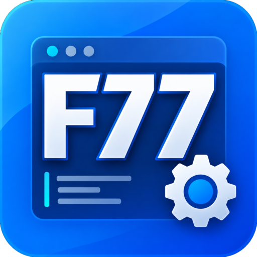

# Easy Fortran 77

A one-click Fortran 77 compiler front-end. You add your `.FOR` files, name the
group, and press one green button: it compiles and links them, then lets you save
the finished program wherever you like. No terminal, no makefiles, no toolchain to
install.

Built for someone who used a DOS-era compiler that produced object files and linked
them, and who is not comfortable at a command line. The interface and the built-in
guide are in **Vietnamese and English**.

## The promise

**Your source files are only ever read. This application never modifies them.**

That is structural, not a policy: one module (`ef-core/src/fs_guard.rs`) is the only
code permitted to touch the filesystem, every write asserts it lands inside the
application's own data directory, `cargo xtask check-hygiene` fails the build if any
other module tries, and the test suite hashes the whole source tree before and after
every single build in the corpus and asserts it is byte-for-byte identical.

It is also why there is **no source editor here**. Editing your code is Notepad's
job.

## Status

**v0.1 — walking skeleton.** Works on Linux against the system `gfortran`. The
bundled Windows toolchain, installer, auto-update and integrity verification are
v0.2 and v1.0 work.

## Something to try it on

`examples/` holds three small programs, with a bilingual guide beside them:

| | |
|---|---|
| `DAMBTCT.FOR` | one file, a reinforced-concrete beam check. Compiles clean. |
| `NHIEUTEP/` | two sources plus an `INCLUDE` the application resolves on its own. Warns, does not fail. |
| `LOI-COT72.FOR` | broken on purpose — a line past column 72, which is the trap card-image code falls into. The "132 columns" option is the fix. |

All four outcomes are asserted by `cargo test -p ef-testkit --test examples`,
including that the broken one still fails and still stops failing at 132
columns. An example that quietly stopped working would be worse than none.

## Building and running

```sh
# Linux (Fedora): the compiler this drives
sudo dnf install gcc-gfortran        # Debian/Ubuntu: sudo apt install gfortran

cargo run -p ef-gui                  # the application
cargo test --workspace               # everything
cargo xtask check-hygiene            # the structural safety rules
cargo xtask fetch-toolchain          # build the bundled compiler from a pinned recipe
cargo xtask fetch-sources            # gather the GPL Corresponding Source
toolchain/verify-under-wine.sh       # exercise the Windows bundle from Linux
cargo xtask package                  # stage and archive a distributable
```

See `packaging/README.md` for the release order (it matters), the Windows
installer, and how to exercise it under wine without waiting for CI.

`fetch-toolchain` downloads the packages named in `toolchain/<target>.toml`,
verifies each against its pinned SHA-256, extracts, prunes 585 MB down to 118 MB,
and writes the integrity manifest. See `toolchain/README.md` — including why the
prune is only correct once the corpus passes against it.

### The headless driver

`ef-cli` runs the same pipeline without a window. It is how CI exercises everything,
and how you diagnose an installation over the phone.

```sh
cargo run -p ef-cli -- doctor                  # what compiler was found, and which flags it takes
cargo run -p ef-cli -- build SOLVER.FOR --json
cargo run -p ef-cli -- build MAIN.FOR SUB.FOR --out ~/Desktop/solver
```

## Layout

| Crate | What it is |
|---|---|
| `ef-core` | All the logic. No GUI dependencies, so the whole pipeline is testable headlessly. |
| `ef-gui` | The window (`eframe`/`egui`). Holds no logic; may not touch the filesystem or spawn processes. |
| `ef-cli` | Headless driver for CI and for support. |
| `ef-testkit` | A fake compiler and a fake program, so the pipeline is testable with no Fortran installed. Also holds the Fortran corpus. |
| `xtask` | Repository chores: the hygiene check, and building the bundled toolchain. |

## What it does and does not do

It **builds**. It does not run your program — that is yours to do, and the guide
explains how (a console program double-clicked from Explorer flashes and closes,
so it tells you to open a Command Prompt or use a small `.bat` file).

The build happens in a temporary working folder, so **Save the program…** is how
you end up with something you keep. That save is the one and only place the
application writes outside its own data directory, it only ever copies something it
built, and it refuses to write over anything that looks like a source file.

## Six things that bite, and what is done about them

**Uppercase `.FOR` gets silently preprocessed.** gcc's suffix matching is
case-sensitive: `.for` is fixed form, but `.FOR` runs the C preprocessor, which then
chokes on apostrophes in comments and on `#` in column 1. DOS-era files are almost
always uppercase. (`.f77` is not a recognised suffix at all.) Every source is copied
into the work tree under a normalised lowercase ASCII name — which also delivers the
read-only guarantee and keeps non-ASCII paths out of the compiler's argv.

**egui's stock font has no Vietnamese, and egui loads no system fonts.** Ubuntu-Light
does not cover Latin Extended Additional (U+1EA0–U+1EF9); Launchpad bug #656690 has
been open since 2010. And unlike some toolkits, egui draws only with fonts it is
handed. So the interface picks one at startup — Segoe UI on Windows, the usual
DejaVu/Liberation/Noto on Linux — and **verifies it can draw Vietnamese before
accepting it**. Being called Segoe UI is not evidence; having the glyphs is. If no
candidate passes, that is logged rather than silently rendered as boxes.

**Old code assumes static, zero-initialised locals.** DOS compilers put locals in
static storage and zeroed them. `-fno-automatic -finit-local-zero` are on by default;
without them the numbers quietly change.

**Sequence numbers live in columns 73–80.** So the default is 72 columns and 132 is a
toggle — never "unlimited", which would read those digits as code.

**A DOS-era `.LIB` cannot be linked, and the linker will not say why.** Libraries
from Microsoft Fortran, Lahey or Watcom are **OMF**, the format Intel defined for the
8086; GNU `ld` reads ELF and PE/COFF and never read OMF. Hand it one and it answers
`file format not recognized`, which tells a non-technical user nothing at all. So
library files are sniffed before the build starts — OMF, wrong architecture, wrong
platform, or not an object file — and refused with a sentence in their own language
saying what the file is and that what the user needs is the Fortran source it was built
from. The detector is checked against every `.a` in both shipped bundles, which is
how it found that a long member name is stored as `/123` into the archive's string
table and must not be mistaken for the symbol table.

OMF is unreadable only to the *linker*; the format itself is documented and simple,
so the application reads it directly and reports what is inside — the module names,
which in OMF are usually the source files each was compiled from, and the routines
each defines. That is what distinguishes the two DOS cases, which need opposite
advice: a library of their own routines needs its Fortran source found, whereas the
compiler's own runtime (`FORTRAN.LIB`, `MATH.LIB` and friends, recognisable by
their C startup modules and Microsoft's `xxxxQQ` naming) is simply not needed at
all — gfortran brings its own. Reading it also settles whether the code is 16-bit,
which is the difference between "no" and "conceivably, via a converter and a
32-bit toolchain".

**A file with a `.FOR` name need not be Fortran.** One real example turned out to be
a data file belonging to an application called FAS4 — a container holding a
tokenised block and a compressed one, with no Fortran anywhere in it. Compiled, it
produced twenty-five errors about invalid characters and statement labels, not one
of which said "this is not a Fortran program". So source files are checked for
being text at all before the compiler runs. The checks are narrow on purpose: form
feeds between listing pages, a DOS Ctrl-Z terminator, tabs and a Vietnamese
codepage's high bytes are all ordinary, and only a NUL byte, a UTF-16 BOM or a
recognised container signature is grounds to refuse. A file saved as Unicode gets
told how to re-save it; a library added to the source list gets pointed at the
library list.

## No unsafe code

```toml
[workspace.lints.rust]
unsafe_code = "forbid"
```

`forbid` rather than `deny`, so it cannot be lifted by an `#[allow]` further in —
the compiler rejects the attribute itself with `E0453`. Nothing here needs unsafe:
the one platform-specific thing the application does, opening a file with a Windows
share mode so it never locks a file the user has open elsewhere, has a safe `std` API.

Verified against both targets, `x86_64-unknown-linux-gnu` and
`x86_64-pc-windows-gnu`, since the `cfg(windows)` paths are the ones a Linux-only
check would miss.

## Licence

`MIT OR Apache-2.0`. Permissive deliberately: a later release bundles GPLv3 gfortran
as a separate process, and this application's own terms must not restrict anyone's
rights over it.

No fonts are bundled: the interface uses whatever ordinary font the machine already
has, which is also what a Windows user finds most legible.
